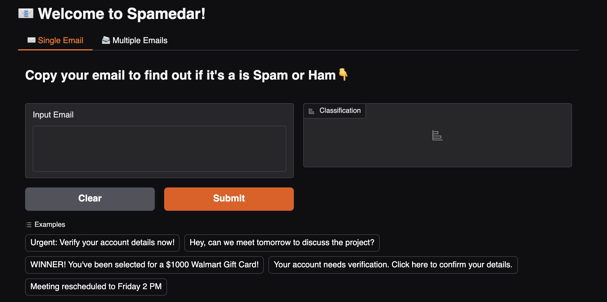

<h1>Spamedar&nbsp&nbsp</h1> 
Simple tool for detecting annoying Emails.

Spamedar is spam classification system using pre-trained BERT model with Gradio interface, supporting both single-text analysis and batch processing of emails. <a href="https://huggingface.co/spaces/raufjivad/spamedar">Demo</a>

## Features ✨

- **Quick Spam Detection**: Classify emails as Spam/Ham in real-time
- **Group Processing**: Upload CSV/TXT files with multiple emails
- **Cloud Ready**: Deployable with one click to Hugging Face Spaces
- **Interactive UI**: User-friendly interface with examples
- **Results Export**: Download full classification results as CSV

## Main Techs 🛠️

### Core Libraries
| Library | Purpose | Version |
|---------|---------|---------|
| 🤗 Transformers | BERT model inference | ≥4.30 |
| Gradio | Web interface | ≥3.0 |
| Pandas | CSV processing | ≥1.0 |
| Torch | Model backend | ≥2.0 |

## Model Details 🤖

- #### Base Model: bert-tiny (4-layer BERT)  
- #### Finetuned On: SMS Spam Collection Dataset  
- #### Accuracy: 98.2% on validation set  
- #### Inference Speed: 0.2s per email (CPU)

<h5>⚙️ Build versions:</h5>
gradio>=3.0
transformers>=4.30
torch>=2.0
pandas>=1.0
python-dotenv>=0.19

<h1></h1>
Acknowledgments:
Model by <a href="https://github.com/Raufjivad/Spamedar/edit/main/README.md">@mrm8488</a>  
UI powered by <a href="https://www.gradio.app">Gradio</a>
Hosting by <a href="https://huggingface.co">Hugging Face</a>
